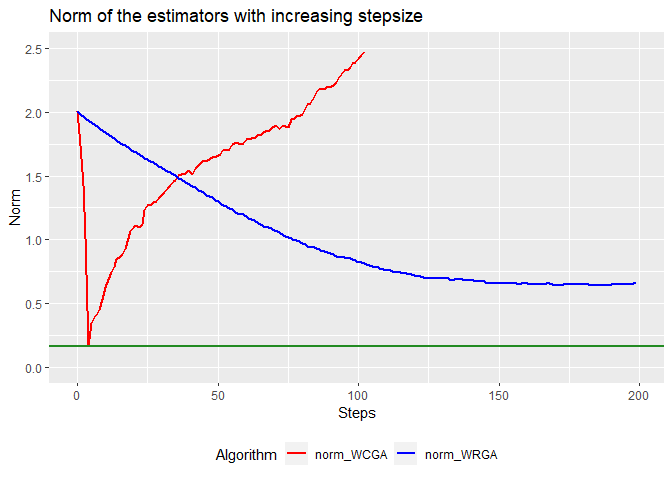

<!-- README.md is generated from README.Rmd. Please edit that file -->

# qboost

<!-- badges: start -->
<!-- badges: end -->

High-dimensional quantile regression using boosting. This repository is
the official implementation of …

## Description

Quantile Regression is a popular tool to model the conditional quantiles
of a response variable. In a high-dimensional setting, the theoretical
results are largely limited to a penalized quantile regression
model([Belloni and Chernozhukov,
2011](https://projecteuclid.org/journals/annals-of-statistics/volume-39/issue-1/%e2%84%931-penalized-quantile-regression-in-high-dimensional-sparse-models/10.1214/10-AOS827.full)).<br />
Instead, we employ a greedy procedure to gradually improve the
regression function. To overcome the non-differentiability of the check
loss funciton, we employ the convolution-type smoothed quantile
regression ([Fernandes, Guerre and Horta,
2019](https://www.tandfonline.com/doi/abs/10.1080/07350015.2019.1660177?journalCode=ubes20)
and [He, Pan, Tan, Zhou](https://arxiv.org/abs/2012.05187)).

## Installation qboost

To install development version from [GitHub](https://github.com/), run
the following commands:

``` r
install.packages("devtools")
library(devtools)
install_github("SvenKlaassen/qboost")
```

## Examples

A simple example. We generate data from a basic linear model
*Y* = *β*<sub>0</sub> + *X*<sup>*T*</sup>*β* + *ϵ*,
where *β*<sub>0</sub> = 1 and *ϵ* ∼ *t*<sub>2</sub>. To account for a
high-dimensional setting, we only generate *n* = 100 observations,
whereas the covariates *X* are generated from a standard multivariate
gaussian distribution of dimension *p* = 500. The coefficient vector is
set to *β*<sub>*j*</sub> = 1 for the first *j* = 1, …*s* components and
0 elsewhere.

``` r
library(MASS)
set.seed(42)
n <- 100; p <- 500; s <- 4
beta <- rep(c(1,0),c(s+1,p-s))

X = mvrnorm(n, rep(0, p), diag(p))
epsilon = rt(n, 2)
Y = cbind(1, X) %*% beta + epsilon
```

Next, we use the orthogonal variant of the qboost algorithm (WCGA, by
setting ) and proceed with for 10 greedy selection steps.

``` r
library(qboost)
n_steps <- 10; tau <- .5
model <- qboost(X,Y,tau = tau, m_stop = n_steps , h = 0.1, kernel = "Gaussian",stepsize = NULL)
# selected covariates
print(model$selection_path)
#>  [1]   3   4   1   2  86  17 452  60 155 324
```

To compare the performance to the oracle model, we apply the conquer
algorithm to the first *s* components of *X* and report the norm of the
coefficient vectors.

``` r
library(conquer)
fit.conquer <- conquer(X[,1:s], Y, tau = tau, h = 0.1, kernel = "Gaussian")
norm_conquer <- sqrt(sum((fit.conquer$coeff-beta[1:(s+1)])^2))

library(ggplot2)
df <- data.frame("norm_qboost" = apply(model$coeff_path,2, function(x) sqrt(sum((x-beta)^2))),
                 "step" = 0:n_steps)

ggplot(df,aes(x = step, y = norm_qboost)) +
  geom_line(color = "red", size = 1) + 
  geom_hline(yintercept = norm_conquer, color = "Forestgreen", size = 1) +
  theme(legend.position="right")
```



## References

-   He, Xuming, et al. “Smoothed quantile regression with large-scale
    inference.” arXiv preprint arXiv:2012.05187 (2020).
    [Paper](https://arxiv.org/abs/2012.05187)

-   Belloni, Alexandre, and Victor Chernozhukov. “ℓ1-penalized quantile
    regression in high-dimensional sparse models.” The Annals of
    Statistics 39.1 (2011): 82-130.
    [Paper](https://projecteuclid.org/journals/annals-of-statistics/volume-39/issue-1/%e2%84%931-penalized-quantile-regression-in-high-dimensional-sparse-models/10.1214/10-AOS827.full)

-   Fernandes, Marcelo, Emmanuel Guerre, and Eduardo Horta. “Smoothing
    quantile regressions.” Journal of Business & Economic Statistics
    39.1 (2021): 338-357.
    [Paper](https://www.tandfonline.com/doi/full/10.1080/07350015.2019.1660177?casa_token=bkJ73Q8oXYIAAAAA%3A0g8P9Bb5elGlCBU8_bsuN_oLauFgMfQcojZmI4ERJO1WVD1M5UOw1RLRix7mMxDMMWukfZR-sbE)
